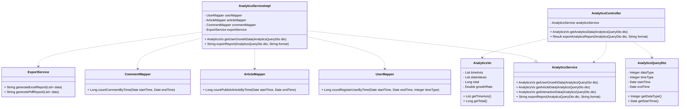

```mermaid
classDiagram
    %% 关系定义
    AnalyticsServiceImpl ..|> AnalyticsService
    AnalyticsController ..> AnalyticsService 
    AnalyticsController ..> AnalyticsQueryDto 
    AnalyticsController ..> AnalyticsVo 
    AnalyticsServiceImpl ..> UserMapper 
    AnalyticsServiceImpl ..> ArticleMapper 
    AnalyticsServiceImpl ..> CommentMapper 
    AnalyticsServiceImpl ..> ExportService

    %% 核心类定义
    class AnalyticsQueryDto {
        - Integer dataType
        - Integer timeType
        - Date startTime
        - Date endTime
        + Integer getDataType()
        + Date getStartTime()
    }

    class AnalyticsVo {
        - List<String> timeAxis
        - List<Long> dataValues
        - Long total
        - Double growthRate
        + List<String> getTimeAxis()
        + Long getTotal()
    }

    class AnalyticsController {
        - AnalyticsService analyticsService
        + AnalyticsVo getAnalyticsData(AnalyticsQueryDto dto)
        + Result exportAnalyticsReport(AnalyticsQueryDto dto, String format)
    }

    class AnalyticsService {
        + AnalyticsVo getUserGrowthData(AnalyticsQueryDto dto)
        + AnalyticsVo getArticleData(AnalyticsQueryDto dto)
        + AnalyticsVo getInteractionData(AnalyticsQueryDto dto)
        + String exportReport(AnalyticsQueryDto dto, String format)
    }

    class AnalyticsServiceImpl {
        - UserMapper userMapper
        - ArticleMapper articleMapper
        - CommentMapper commentMapper
        - ExportService exportService
        + AnalyticsVo getUserGrowthData(AnalyticsQueryDto dto)
        + String exportReport(AnalyticsQueryDto dto, String format)
    }

    class ExportService {
        + String generateExcelReport(List<Map<String, Object>> data)
        + String generatePdfReport(List<Map<String, Object>> data)
    }

    class UserMapper {
        + Long countRegisterUserByTime(Date startTime, Date endTime, Integer timeType)
    }

    class ArticleMapper {
        + Long countPublishArticleByTime(Date startTime, Date endTime)
    }

    class CommentMapper {
        + Long countCommentByTime(Date startTime, Date endTime)
    }
```