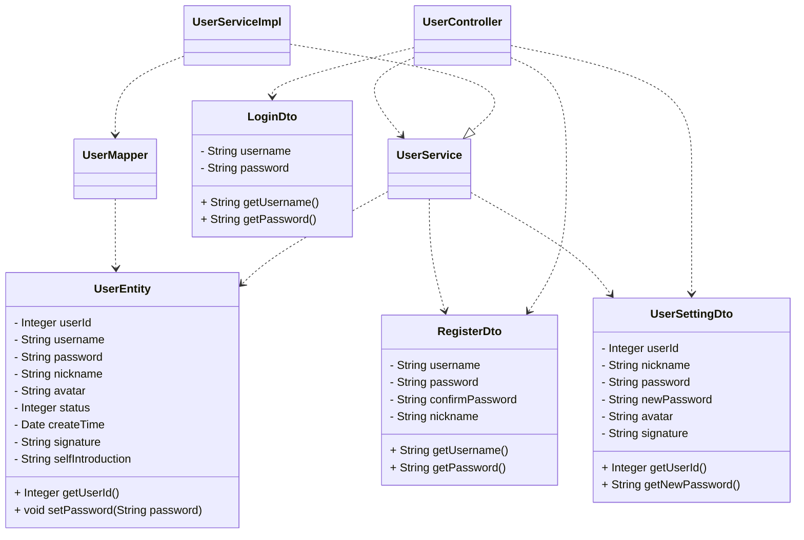

```mermaid
classDiagram
    UserServiceImpl ..|> UserService
    UserController ..> UserService
    UserController ..> LoginDto
    UserController ..> RegisterDto
    UserController ..> UserSettingDto
    UserServiceImpl ..> UserMapper
    UserService ..> UserEntity
    UserService ..> RegisterDto
    UserService ..> UserSettingDto
    UserMapper ..> UserEntity

    class UserSettingDto {
        - Integer userId
        - String nickname
        - String password
        - String newPassword
        - String avatar
        - String signature
        + Integer getUserId()
        + String getNewPassword()
    }

    class UserEntity {
        - Integer userId
        - String username
        - String password
        - String nickname
        - String avatar
        - Integer status
        - Date createTime
        - String signature
        - String selfIntroduction
        + Integer getUserId()
        + void setPassword(String password)
    }
class LoginDto {
        - String username
        - String password
        + String getUsername()
        + String getPassword()
    }

    class RegisterDto {
        - String username
        - String password
        - String confirmPassword
        - String nickname
        + String getUsername()
        + String getPassword()
    }

```