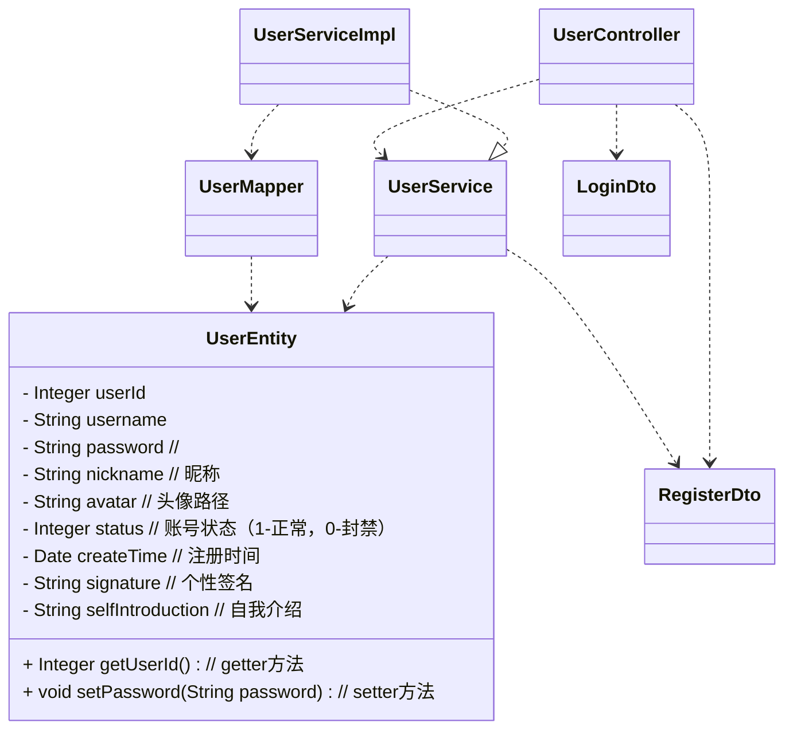

```mermaid
classDiagram
    %% 实现关系：ServiceImpl 实现 Service 接口
    UserServiceImpl ..|> UserService
    %% 依赖关系：Controller 依赖 Service / ServiceImpl 依赖 Mapper
    UserController ..> UserService
    UserServiceImpl ..> UserMapper
    %% 关联关系：核心数据载体关联
    UserService ..> UserEntity
    UserMapper ..> UserEntity
    UserController ..> LoginDto
    UserController ..> RegisterDto
    UserService ..> RegisterDto

    %% 用户实体类（存储用户核心数据）
    class UserEntity {
        - Integer userId       
        - String username   
        - String password      // 
        - String nickname      // 昵称
        - String avatar        // 头像路径
        - Integer status       // 账号状态（1-正常，0-封禁）
        - Date createTime      // 注册时间
        - String signature     // 个性签名
        - String selfIntroduction // 自我介绍
        + Integer getUserId()  // getter方法
        + void setPassword(String password) // setter方法
    }


    
```