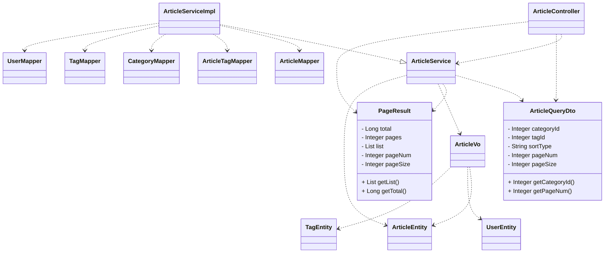

```mermaid
classDiagram
    %% 核心关系定义
    ArticleServiceImpl ..|> ArticleService
    ArticleController ..> ArticleService
    ArticleController ..> ArticleQueryDto
    ArticleController ..> PageResult
    ArticleService ..> ArticleQueryDto
    ArticleService ..> PageResult
    ArticleService ..> ArticleVo
    ArticleService ..> ArticleEntity
    ArticleVo ..> ArticleEntity            
    ArticleVo ..> UserEntity    
    ArticleVo ..> TagEntity      
    ArticleServiceImpl ..> ArticleMapper
    ArticleServiceImpl ..> ArticleTagMapper
    ArticleServiceImpl ..> CategoryMapper
    ArticleServiceImpl ..> TagMapper
    ArticleServiceImpl ..> UserMapper

    %% 博客列表查询条件类
    class ArticleQueryDto {
        - Integer categoryId
        - Integer tagId
        - String sortType
        - Integer pageNum
        - Integer pageSize
        + Integer getCategoryId()
        + Integer getPageNum()
    }
    %% 博客列表分页结果类（泛型）
    class PageResult {
        - Long total
        - Integer pages
        - List<T> list
        - Integer pageNum
        - Integer pageSize
        + List<T> getList()
        + Long getTotal()
    }


```