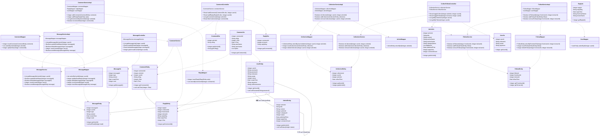

```mermaid
classDiagram
    %% 核心关系定义
 
    CommentServiceImpl ..|> CommentService 
    CommentEntity "1" -- "n" ReplyEntity    

    UserEntity "n" -- "n" ArticleEntity : 收藏 via CollectionEntity

    UserEntity "n" -- "n" UserEntity : 关注 via FollowEntity

    UserEntity "1" -- "n" MessageEntity    
    
    MessageServiceImpl ..|> MessageService
    MessageController ..> MessageService
    MessageController ..> MessageVo
    MessageService ..> MessageEntity
    MessageServiceImpl ..> MessageMapper
    MessageMapper ..> MessageEntity
    MessageVo ..> MessageEntity


    CommentController ..> CommentService
    CommentController ..> CommentDto
    CommentController ..> ReplyDto
    CommentService ..> CommentEntity
    CommentService ..> ReplyEntity
    CommentServiceImpl ..> CommentMapper
    CommentServiceImpl ..> ReplyMapper
    CommentMapper ..> CommentEntity
    ReplyMapper ..> ReplyEntity
    CommentVo ..> CommentEntity           
    CommentVo ..> ReplyEntity             
    CommentVo ..> UserEntity

    CollectFollowController ..> CollectionService
    CollectFollowController ..> FollowService
    CollectionServiceImpl ..|> CollectionService
    FollowServiceImpl ..|> FollowService
    CollectionServiceImpl ..> CollectionMapper
    CollectionServiceImpl ..> ArticleMapper
    FollowServiceImpl ..> FollowMapper
    FollowServiceImpl ..> UserMapper
    CollectionService ..> CollectionEntity
    FollowService ..> FollowEntity
    CollectionMapper ..> CollectionEntity
    FollowMapper ..> FollowEntity
    CollectFollowController ..> ArticleVo
    CollectFollowController ..> UserVo

    %% 评论实体类
    class CommentEntity {
        - Integer commentId
        - Integer articleId
        - Integer userId
        - String cMsg
        - Integer cStar
        - Date cTime
        + Integer getCommentId()
        + void setCStar(Integer cStar)
    }

    %% 回复实体类
    class ReplyEntity {
        - Integer replyId
        - Integer commentId
        - Integer fromUserId
        - Integer toUserId
        - String replyMsg
        - Date replyTime
        - Integer rStar
        + Integer getCommentId()
    }

    %% 评论请求类
    class CommentDto {
        - Integer articleId
        - String cMsg
        + Integer getArticleId()
        + String getCMsg()
    }

    %% 回复请求类
    class ReplyDto {
        - Integer commentId
        - Integer toUserId
        - String replyMsg
        + Integer getCommentId()
    }

    %% 评论VO类
    class CommentVo {
        - Integer commentId
        - String cMsg
        - Integer cStar
        - Date cTime
        - String userName
        - String userAvatar
        - List<ReplyVo> replies
        + Integer getCommentId()
    }

    %% 回复VO类
    class ReplyVo {
        - Integer replyId
        - String replyMsg
        - Date replyTime
        - String fromUserName
        - String toUserName
        + Integer getReplyId()
    }

    %% 收藏实体类
    class CollectionEntity {
        - Integer collectionId
        - Integer userId
        - Integer articleId
        - Date collectTime
        + Integer getUserId()
        + Integer getArticleId()
    }

    %% 关注实体类
    class FollowEntity {
        - Integer followId
        - Integer fromUserId
        - Integer toUserId
        - Date followTime
        + Integer getFromUserId()
        + Integer getToUserId()
    }

    %% 收藏/关注控制器类
    class CollectFollowController {
        - CollectionService collectionService
        - FollowService followService
        + Result toggleCollect(Integer articleId, Integer userId)
        + Result toggleFollow(Integer toUserId, Integer userId)
        + List<ArticleVo> getMyCollections(Integer userId)
        + List<UserVo> getMyFollows(Integer userId)
    }

    %% 收藏服务接口
   class CollectionService {
        + Boolean isCollected(Integer userId, Integer articleId)
        + Boolean addCollection(CollectionEntity collection)
        + Boolean removeCollection(Integer userId, Integer articleId)
    }

    %% 关注服务接口
    class FollowService {
        + Boolean isFollowed(Integer fromUserId, Integer toUserId)
        + Boolean addFollow(FollowEntity follow)
        + Boolean removeFollow(Integer fromUserId, Integer toUserId)
    }

    %% 收藏服务实现类
    class CollectionServiceImpl {
        - CollectionMapper collectionMapper
        - ArticleMapper articleMapper
        + Boolean isCollected(Integer userId, Integer articleId)
        + Boolean addCollection(CollectionEntity collection)
        + Boolean removeCollection(Integer userId, Integer articleId)
    }

    %% 关注服务实现类
    class FollowServiceImpl {
        - FollowMapper followMapper
        - UserMapper userMapper
        + Boolean isFollowed(Integer fromUserId, Integer toUserId)
        + Boolean addFollow(FollowEntity follow)
        + Boolean removeFollow(Integer fromUserId, Integer toUserId)
    }

    %% 收藏数据访问接口
    class CollectionMapper {
        + CollectionEntity selectByUserAndArticle(Integer userId, Integer articleId)
        + Integer insertCollection(CollectionEntity collection)
        + Integer deleteCollection(Integer userId, Integer articleId)
    }

    %% 关注数据访问接口
    class FollowMapper {
        + FollowEntity selectByFromAndTo(Integer fromUserId, Integer toUserId)
        + Integer insertFollow(FollowEntity follow)
        + Integer deleteFollow(Integer fromUserId, Integer toUserId)
    }

    %% 消息实体类
    class MessageEntity {
        - Integer messageId
        - Integer userId
        - Integer type
        - String content
        - Date createTime
        - Integer read
        + Integer getUserId()
        + void setRead(Integer read)
    }

    %% 消息VO类
    class MessageVo {
        - Integer messageId
        - Integer type
        - String content
        - Date createTime
        - Integer read
        + Integer getMessageId()
    }

    %% 消息控制器类
    class MessageController {
        - MessageService messageService
        + List<MessageVo> getMessageList(Integer userId)
        + Result markAsRead(Integer messageId)
        + Result deleteMessage(Integer messageId)
        + Integer getUnreadCount(Integer userId)
    }

    %% 消息服务接口
    class MessageService {
        + List<MessageEntity> getMessagesByUserId(Integer userId)
        + Boolean updateReadStatus(Integer messageId)
        + Boolean deleteMessage(Integer messageId)
        + Integer countUnread(Integer userId)
        + Boolean sendMessage(MessageEntity message)
    }

    %% 消息服务实现类
    class MessageServiceImpl {
        - MessageMapper messageMapper
        + List<MessageEntity> getMessagesByUserId(Integer userId)
        + Boolean updateReadStatus(Integer messageId)
        + Boolean deleteMessage(Integer messageId)
        + Integer countUnread(Integer userId)
        + Boolean sendMessage(MessageEntity message)
    }

    %% 消息数据访问接口（修正修饰符：接口方法为公有+）
   class MessageMapper {
        + List<MessageEntity> selectByUserId(Integer userId)
        + Integer updateReadStatus(Integer messageId)
        + Integer deleteMessage(Integer messageId)
        + Integer countUnread(Integer userId)
        + Integer insertMessage(MessageEntity message)
    }

    %% 基础依赖类/接口（复用+补充）
    class UserEntity {
        - Integer userId
        - String username
        - String password
        - String nickname
        - String avatar
        - Integer status
        - Date createTime
        - String signature
        - String selfIntroduction
        + Integer getUserId()
        + void setPassword(String password)
    }

    class ArticleEntity {
        - Integer articleId
        - String title
        - String content
        - Integer authorId
        - Integer categoryId
        - Integer status
        - Date publishedTime
        - Integer pageView
        - Integer commentCount
        + Integer getArticleId()
        + void setStatus(Integer status)
    }

    class ArticleVo {
        - Integer articleId
        - String title
        - String content
        - String authorName
        - String authorAvatar
        - String categoryName
        - List<String> tagNames
        - Date publishedTime
        - Integer pageView
        - Integer commentCount
        + Integer getArticleId()
    }

    class UserVo {
        - Integer userId
        - String nickname
        - String avatar
        - String signature
        + Integer getUserId()
    }

   class ArticleMapper {
        + ArticleEntity selectById(Integer articleId)
    }

    class UserMapper {
        + UserEntity selectById(Integer userId)
    }

    class CommentMapper {
        + Integer insertComment(CommentEntity comment)
        + List<CommentEntity> selectByArticleId(Integer articleId)
        + Integer updateStar(Integer commentId)
    }

   class ReplyMapper {
        + Integer insertReply(ReplyEntity reply)
        + List<ReplyEntity> selectByCommentId(Integer commentId)
    }

    class CommentController {
        - CommentService commentService
        + Result addComment(CommentDto dto, Integer userId)
        + Result addReply(ReplyDto dto, Integer userId)
        + List<CommentVo> getCommentList(Integer articleId)
        + Result likeComment(Integer commentId)
    }

    class CommentServiceImpl {
        - CommentMapper commentMapper
        - ReplyMapper replyMapper
        - UserMapper userMapper
        + Integer addComment(CommentEntity comment)
        + Integer addReply(ReplyEntity reply)
        + List<CommentEntity> getCommentsByArticleId(Integer articleId)
        + Boolean incrementStar(Integer commentId)
    }
```