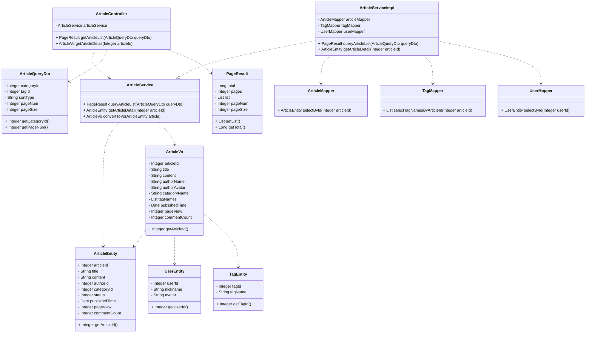

```mermaid
classDiagram
    %% 关系定义
    ArticleServiceImpl ..|> ArticleService
    ArticleController ..> ArticleService
    ArticleController ..> ArticleQueryDto
    ArticleController ..> PageResult
    ArticleServiceImpl ..> ArticleMapper
    ArticleServiceImpl ..> TagMapper
    ArticleServiceImpl ..> UserMapper
    ArticleService ..> ArticleEntity
    ArticleService ..> ArticleVo
    ArticleVo ..> ArticleEntity
    ArticleVo ..> UserEntity
    ArticleVo ..> TagEntity

    %% 核心类定义
    class ArticleQueryDto {
        - Integer categoryId
        - Integer tagId
        - String sortType
        - Integer pageNum
        - Integer pageSize
        + Integer getCategoryId()
        + Integer getPageNum()
    }

    class PageResult {
        - Long total
        - Integer pages
        - List<T> list
        - Integer pageNum
        - Integer pageSize
        + List<T> getList()
        + Long getTotal()
    }

    class ArticleVo {
        - Integer articleId
        - String title
        - String content
        - String authorName
        - String authorAvatar
        - String categoryName
        - List<String> tagNames
        - Date publishedTime
        - Integer pageView
        - Integer commentCount
        + Integer getArticleId()
    }

    class ArticleController {
        - ArticleService articleService
        + PageResult<ArticleVo> getArticleList(ArticleQueryDto queryDto)
        + ArticleVo getArticleDetail(Integer articleId)
    }

    class ArticleService {
        + PageResult<ArticleEntity> queryArticleList(ArticleQueryDto queryDto)
        + ArticleEntity getArticleDetail(Integer articleId)
        + ArticleVo convertToVo(ArticleEntity article)
    }

    class ArticleServiceImpl {
        - ArticleMapper articleMapper
        - TagMapper tagMapper
        - UserMapper userMapper
        + PageResult<ArticleEntity> queryArticleList(ArticleQueryDto queryDto)
        + ArticleEntity getArticleDetail(Integer articleId)
    }

    class ArticleMapper {
        + ArticleEntity selectById(Integer articleId)
    }

    class TagMapper {
        + List<String> selectTagNamesByArticleId(Integer articleId)
    }

    class UserMapper {
        + UserEntity selectById(Integer userId)
    }

    class ArticleEntity {
        - Integer articleId
        - String title
        - String content
        - Integer authorId
        - Integer categoryId
        - Integer status
        - Date publishedTime
        - Integer pageView
        - Integer commentCount
        + Integer getArticleId()
    }

    class UserEntity {
        - Integer userId
        - String nickname
        - String avatar
        + Integer getUserId()
    }

    class TagEntity {
        - Integer tagId
        - String tagName
        + Integer getTagId()
    }
```