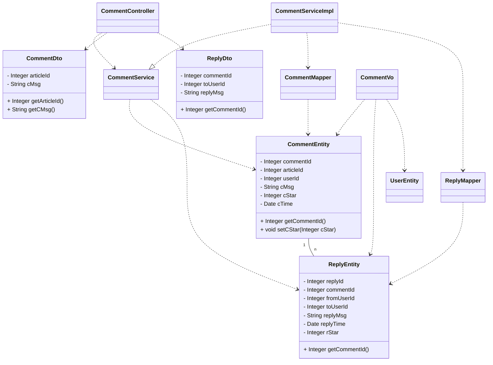

```mermaid
classDiagram
    %% 核心关系定义
    CommentServiceImpl ..|> CommentService 
    CommentEntity "1" -- "n" ReplyEntity    
    CommentController ..> CommentService
    CommentController ..> CommentDto
    CommentController ..> ReplyDto
    CommentService ..> CommentEntity
    CommentService ..> ReplyEntity
    CommentServiceImpl ..> CommentMapper
    CommentServiceImpl ..> ReplyMapper
    CommentMapper ..> CommentEntity
    ReplyMapper ..> ReplyEntity
    CommentVo ..> CommentEntity           
    CommentVo ..> ReplyEntity             
    CommentVo ..> UserEntity               

    %% 评论实体类
    class CommentEntity {
        - Integer commentId
        - Integer articleId
        - Integer userId
        - String cMsg
        - Integer cStar
        - Date cTime
        + Integer getCommentId()
        + void setCStar(Integer cStar)
    }

    %% 回复实体类
    class ReplyEntity {
        - Integer replyId
        - Integer commentId
        - Integer fromUserId
        - Integer toUserId
        - String replyMsg
        - Date replyTime
        - Integer rStar
        + Integer getCommentId()
    }

    %% 评论请求类
    class CommentDto {
        - Integer articleId
        - String cMsg
        + Integer getArticleId()
        + String getCMsg()
    }

    %% 回复请求类
    class ReplyDto {
        - Integer commentId
        - Integer toUserId
        - String replyMsg
        + Integer getCommentId()
    }

```