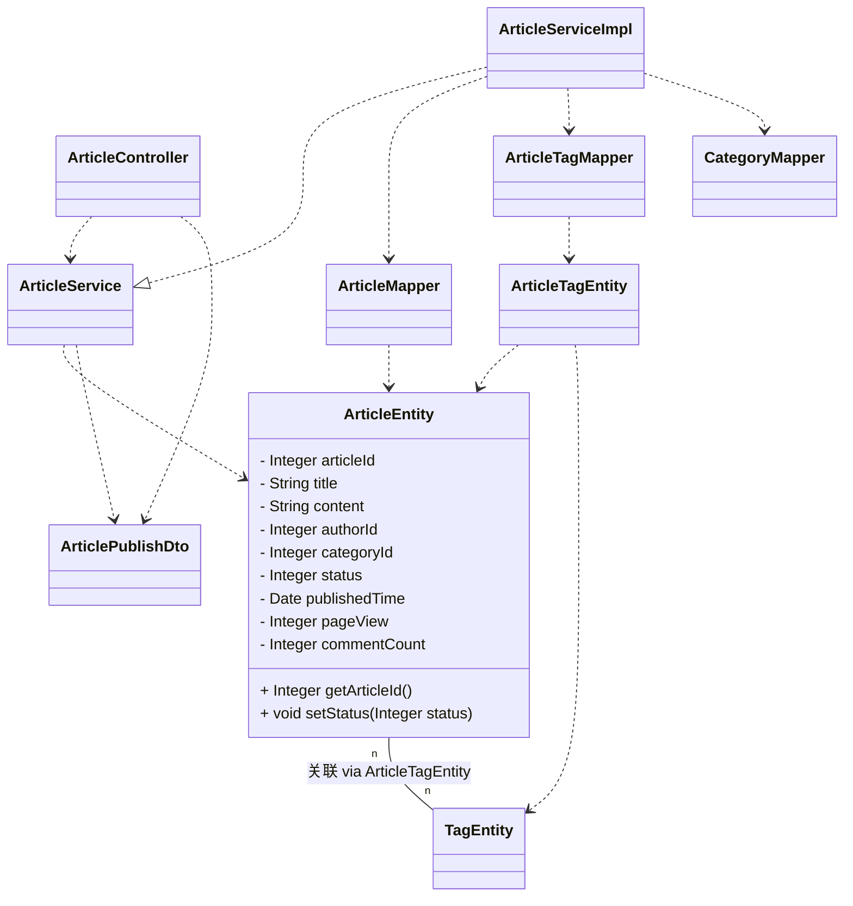

```mermaid
classDiagram
    %% 核心关系定义
    ArticleServiceImpl ..|> ArticleService  
    ArticleEntity "n" -- "n" TagEntity : 关联 via ArticleTagEntity  
    ArticleTagEntity ..> ArticleEntity     
    ArticleTagEntity ..> TagEntity         
    
    %% 依赖关系
    ArticleController ..> ArticleService
    ArticleController ..> ArticlePublishDto
    ArticleServiceImpl ..> ArticleMapper
    ArticleServiceImpl ..> ArticleTagMapper
    ArticleServiceImpl ..> CategoryMapper
    ArticleService ..> ArticleEntity
    ArticleService ..> ArticlePublishDto
    ArticleMapper ..> ArticleEntity
    ArticleTagMapper ..> ArticleTagEntity

    %% 文章实体类
    class ArticleEntity {
        - Integer articleId
        - String title
        - String content
        - Integer authorId
        - Integer categoryId
        - Integer status
        - Date publishedTime
        - Integer pageView
        - Integer commentCount
        + Integer getArticleId()
        + void setStatus(Integer status)
    }

```