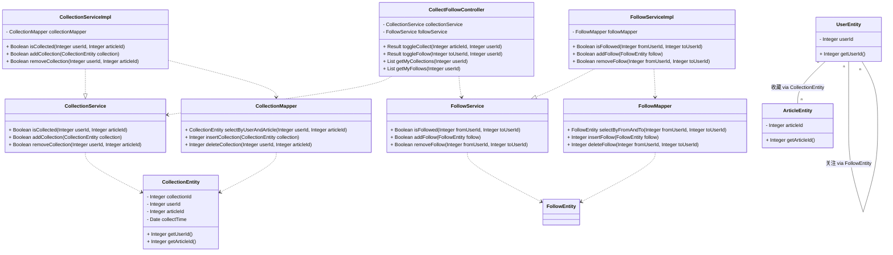

```mermaid
classDiagram
    %% 关系定义
    CollectionServiceImpl ..|> CollectionService
    FollowServiceImpl ..|> FollowService
    UserEntity "n" -- "n" ArticleEntity : 收藏 via CollectionEntity
    UserEntity "n" -- "n" UserEntity : 关注 via FollowEntity
    CollectFollowController ..> CollectionService
    CollectFollowController ..> FollowService
    CollectionService ..> CollectionEntity
    FollowService ..> FollowEntity
    CollectionServiceImpl ..> CollectionMapper
    FollowServiceImpl ..> FollowMapper
    CollectionMapper ..> CollectionEntity
    FollowMapper ..> FollowEntity

    %% 核心类定义
    class CollectionEntity {
        - Integer collectionId
        - Integer userId
        - Integer articleId
        - Date collectTime
        + Integer getUserId()
        + Integer getArticleId()
    }

    

    class CollectFollowController {
        - CollectionService collectionService
        - FollowService followService
        + Result toggleCollect(Integer articleId, Integer userId)
        + Result toggleFollow(Integer toUserId, Integer userId)
        + List<ArticleVo> getMyCollections(Integer userId)
        + List<UserVo> getMyFollows(Integer userId)
    }

    class CollectionService {
        + Boolean isCollected(Integer userId, Integer articleId)
        + Boolean addCollection(CollectionEntity collection)
        + Boolean removeCollection(Integer userId, Integer articleId)
    }

    class FollowService {
        + Boolean isFollowed(Integer fromUserId, Integer toUserId)
        + Boolean addFollow(FollowEntity follow)
        + Boolean removeFollow(Integer fromUserId, Integer toUserId)
    }

    class CollectionServiceImpl {
        - CollectionMapper collectionMapper
        + Boolean isCollected(Integer userId, Integer articleId)
        + Boolean addCollection(CollectionEntity collection)
        + Boolean removeCollection(Integer userId, Integer articleId)
    }

    class FollowServiceImpl {
        - FollowMapper followMapper
        + Boolean isFollowed(Integer fromUserId, Integer toUserId)
        + Boolean addFollow(FollowEntity follow)
        + Boolean removeFollow(Integer fromUserId, Integer toUserId)
    }

    class CollectionMapper {
        + CollectionEntity selectByUserAndArticle(Integer userId, Integer articleId)
        + Integer insertCollection(CollectionEntity collection)
        + Integer deleteCollection(Integer userId, Integer articleId)
    }

    class FollowMapper {
        + FollowEntity selectByFromAndTo(Integer fromUserId, Integer toUserId)
        + Integer insertFollow(FollowEntity follow)
        + Integer deleteFollow(Integer fromUserId, Integer toUserId)
    }

    class ArticleEntity {
        - Integer articleId
        + Integer getArticleId()
    }

    class UserEntity {
        - Integer userId
        + Integer getUserId()
    }

   
```