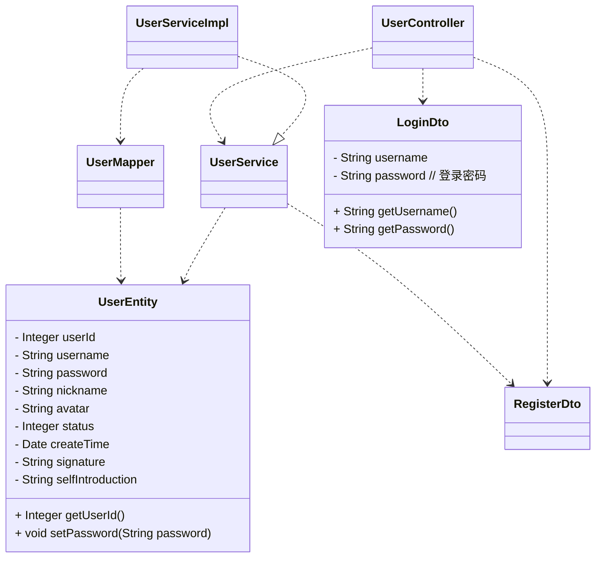

```mermaid
classDiagram
    %% 实现关系：ServiceImpl 实现 Service 接口
    UserServiceImpl ..|> UserService
    %% 依赖关系：Controller 依赖 Service / ServiceImpl 依赖 Mapper
    UserController ..> UserService
    UserServiceImpl ..> UserMapper
    %% 关联关系：核心数据载体关联
    UserService ..> UserEntity
    UserMapper ..> UserEntity
    UserController ..> LoginDto
    UserController ..> RegisterDto
    UserService ..> RegisterDto

    %% 用户实体类（存储用户核心数据）
    class UserEntity {
        - Integer userId       
        - String username   
        - String password       
        - String nickname
        - String avatar
        - Integer status
        - Date createTime
        - String signature
        - String selfIntroduction 
        + Integer getUserId()
        + void setPassword(String password)
    }
    %% 登录请求数据传输类（接收前端参数）
    class LoginDto {
        - String username 
        - String password      // 登录密码
        + String getUsername()
        + String getPassword()
    }

    
```