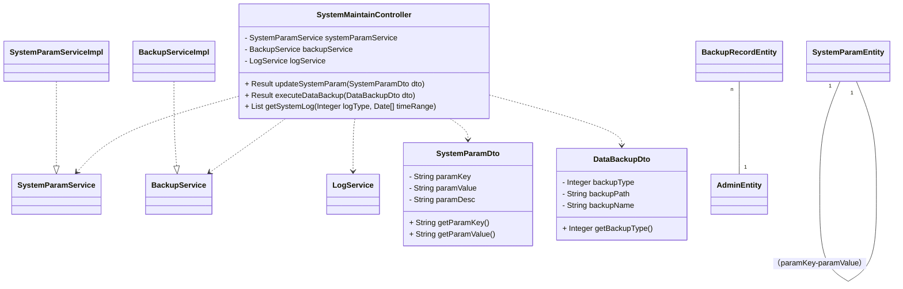

```mermaid
classDiagram
    %% 关系定义
    SystemParamServiceImpl ..|> SystemParamService 
    BackupServiceImpl ..|> BackupService
    SystemMaintainController ..> SystemParamService 
    SystemMaintainController ..> BackupService 
    SystemMaintainController ..> LogService 
    SystemMaintainController ..> SystemParamDto
    SystemMaintainController ..> DataBackupDto 
    SystemParamEntity "1" -- "1" SystemParamEntity : （paramKey-paramValue）
    BackupRecordEntity "n" -- "1" AdminEntity

    %% 核心类定义
    class SystemParamDto {
        - String paramKey
        - String paramValue
        - String paramDesc
        + String getParamKey()
        + String getParamValue()
    }

    class DataBackupDto {
        - Integer backupType
        - String backupPath
        - String backupName
        + Integer getBackupType()
    }

    class SystemMaintainController {
        - SystemParamService systemParamService
        - BackupService backupService
        - LogService logService
        + Result updateSystemParam(SystemParamDto dto)
        + Result executeDataBackup(DataBackupDto dto)
        + List<SystemLogEntity> getSystemLog(Integer logType, Date[] timeRange)
    }


```