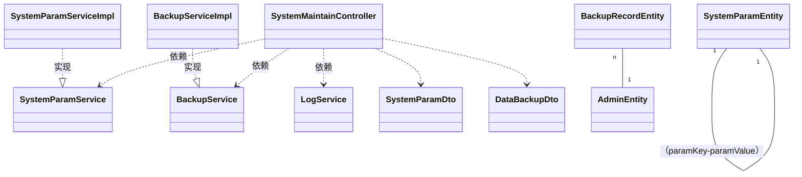

```mermaid
classDiagram
    %% 关系定义
    SystemParamServiceImpl ..|> SystemParamService : 实现
    BackupServiceImpl ..|> BackupService : 实现
    SystemMaintainController ..> SystemParamService : 依赖
    SystemMaintainController ..> BackupService : 依赖
    SystemMaintainController ..> LogService : 依赖
    SystemMaintainController ..> SystemParamDto
    SystemMaintainController ..> DataBackupDto 
    SystemParamEntity "1" -- "1" SystemParamEntity : （paramKey-paramValue）
    BackupRecordEntity "n" -- "1" AdminEntity

   
```