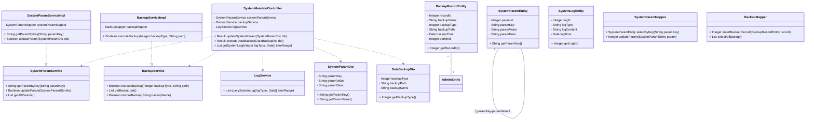

```mermaid
classDiagram
    %% 关系定义
    SystemParamServiceImpl ..|> SystemParamService 
    BackupServiceImpl ..|> BackupService
    SystemMaintainController ..> SystemParamService 
    SystemMaintainController ..> BackupService 
    SystemMaintainController ..> LogService 
    SystemMaintainController ..> SystemParamDto
    SystemMaintainController ..> DataBackupDto 
    SystemParamEntity "1" -- "1" SystemParamEntity : （paramKey-paramValue）
    BackupRecordEntity "n" -- "1" AdminEntity

    %% 核心类定义
    class SystemParamDto {
        - String paramKey
        - String paramValue
        - String paramDesc
        + String getParamKey()
        + String getParamValue()
    }

    class DataBackupDto {
        - Integer backupType
        - String backupPath
        - String backupName
        + Integer getBackupType()
    }

    class SystemMaintainController {
        - SystemParamService systemParamService
        - BackupService backupService
        - LogService logService
        + Result updateSystemParam(SystemParamDto dto)
        + Result executeDataBackup(DataBackupDto dto)
        + List<SystemLogEntity> getSystemLog(Integer logType, Date[] timeRange)
    }

    class SystemParamService {
        + String getParamByKey(String paramKey)
        + Boolean updateParam(SystemParamDto dto)
        + List<SystemParamEntity> getAllParams()
    }

    class SystemParamServiceImpl {
        - SystemParamMapper systemParamMapper
        + String getParamByKey(String paramKey)
        + Boolean updateParam(SystemParamDto dto)
    }

    class BackupService {
        + Boolean executeBackup(Integer backupType, String path)
        + List<BackupRecordEntity> getBackupList()
        + Boolean restoreBackup(String backupName)
    }

    class BackupServiceImpl {
        - BackupMapper backupMapper
        + Boolean executeBackup(Integer backupType, String path)
    }
    class SystemParamEntity {
        - Integer paramId
        - String paramKey
        - String paramValue
        - String paramDesc
        + String getParamKey()
    }

    class BackupRecordEntity {
        - Integer recordId
        - String backupName
        - Integer backupType
        - String backupPath
        - Date backupTime
        - Integer adminId
        + Integer getRecordId()
    }

    class SystemLogEntity {
        - Integer logId
        - String logType
        - String logContent
        - Date logTime
        + Integer getLogId()
    }

    class LogService {
        + List<SystemLogEntity> querySystemLog( logType, Date[] timeRange)
    }

    class SystemParamMapper {
        + SystemParamEntity selectByKey(String paramKey)
        + Integer updateParam(SystemParamEntity param)
    }

    class BackupMapper {
        + Integer insertBackupRecord(BackupRecordEntity record)
        + List<BackupRecordEntity> selectAllBackup()
    }
```