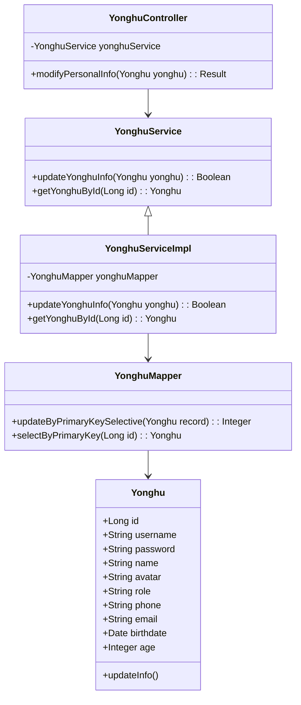

```mermaid
classDiagram
    class Yonghu{
        +Long id
        +String username
        +String password
        +String name
        +String avatar
        +String role
        +String phone
        +String email
        +Date birthdate
        +Integer age
        +updateInfo()
    }
    class YonghuService{
        +updateYonghuInfo(Yonghu yonghu) : Boolean
        +getYonghuById(Long id) : Yonghu
    }
    YonghuService <|-- YonghuServiceImpl
    class YonghuServiceImpl{
        -YonghuMapper yonghuMapper
        +updateYonghuInfo(Yonghu yonghu) : Boolean
        +getYonghuById(Long id) : Yonghu
    }
    class YonghuMapper{
        +updateByPrimaryKeySelective(Yonghu record) : Integer
        +selectByPrimaryKey(Long id) : Yonghu
    }
    class YonghuController{
        -YonghuService yonghuService
        +modifyPersonalInfo(Yonghu yonghu) : Result
    }
    YonghuController --> YonghuService
    YonghuServiceImpl --> YonghuMapper
    YonghuMapper --> Yonghu
```