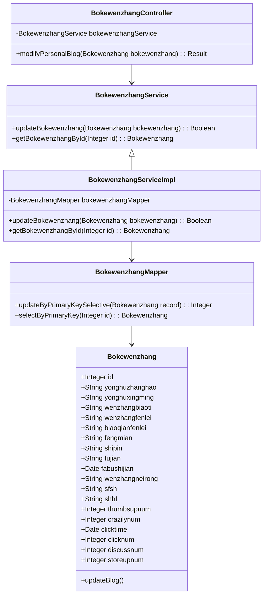

```mermaid
classDiagram
    class Bokewenzhang{
        +Integer id
        +String yonghuzhanghao
        +String yonghuxingming
        +String wenzhangbiaoti
        +String wenzhangfenlei
        +String biaoqianfenlei
        +String fengmian
        +String shipin
        +String fujian
        +Date fabushijian
        +String wenzhangneirong
        +String sfsh
        +String shhf
        +Integer thumbsupnum
        +Integer crazilynum
        +Date clicktime
        +Integer clicknum
        +Integer discussnum
        +Integer storeupnum
        +updateBlog()
    }
    class BokewenzhangService{
        +updateBokewenzhang(Bokewenzhang bokewenzhang) : Boolean
        +getBokewenzhangById(Integer id) : Bokewenzhang
    }
    BokewenzhangService <|-- BokewenzhangServiceImpl
    class BokewenzhangServiceImpl{
        -BokewenzhangMapper bokewenzhangMapper
        +updateBokewenzhang(Bokewenzhang bokewenzhang) : Boolean
        +getBokewenzhangById(Integer id) : Bokewenzhang
    }
    class BokewenzhangMapper{
        +updateByPrimaryKeySelective(Bokewenzhang record) : Integer
        +selectByPrimaryKey(Integer id) : Bokewenzhang
    }
    class BokewenzhangController{
        -BokewenzhangService bokewenzhangService
        +modifyPersonalBlog(Bokewenzhang bokewenzhang) : Result
    }
    BokewenzhangController --> BokewenzhangService
    BokewenzhangServiceImpl --> BokewenzhangMapper
    BokewenzhangMapper --> Bokewenzhang
```