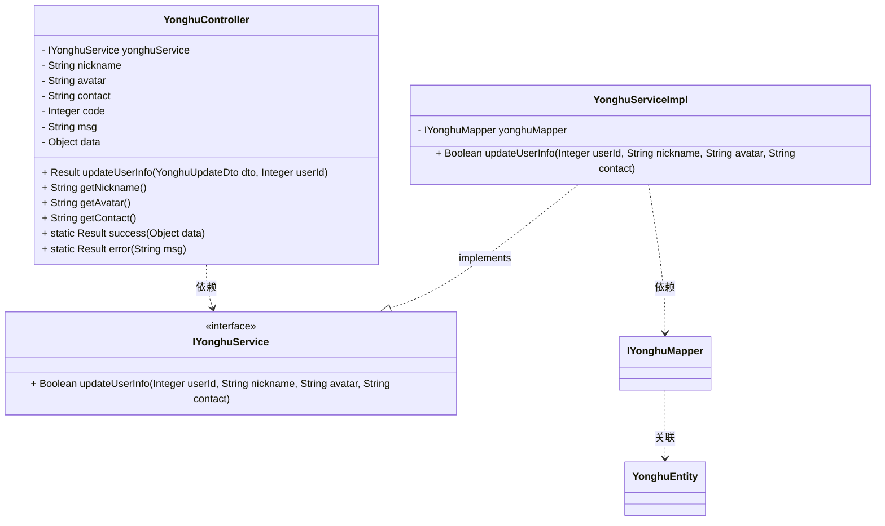

```mermaid
classDiagram
    %% 关系定义（适配iodraw）
    YonghuServiceImpl ..|> IYonghuService : implements
    YonghuController ..> IYonghuService : 依赖
    YonghuServiceImpl ..> IYonghuMapper : 依赖
    IYonghuMapper ..> YonghuEntity : 关联

   
    class YonghuController {
        - IYonghuService yonghuService
        + Result updateUserInfo(YonghuUpdateDto dto, Integer userId)
        - String nickname
        - String avatar
        - String contact
        + String getNickname()
        + String getAvatar()
        + String getContact()
        - Integer code
        - String msg
        - Object data
        + static Result success(Object data)
        + static Result error(String msg)
    }

    class IYonghuService <<interface>> {
        + Boolean updateUserInfo(Integer userId, String nickname, String avatar, String contact)
    }

    class YonghuServiceImpl {
        - IYonghuMapper yonghuMapper
        + Boolean updateUserInfo(Integer userId, String nickname, String avatar, String contact)
    }

```