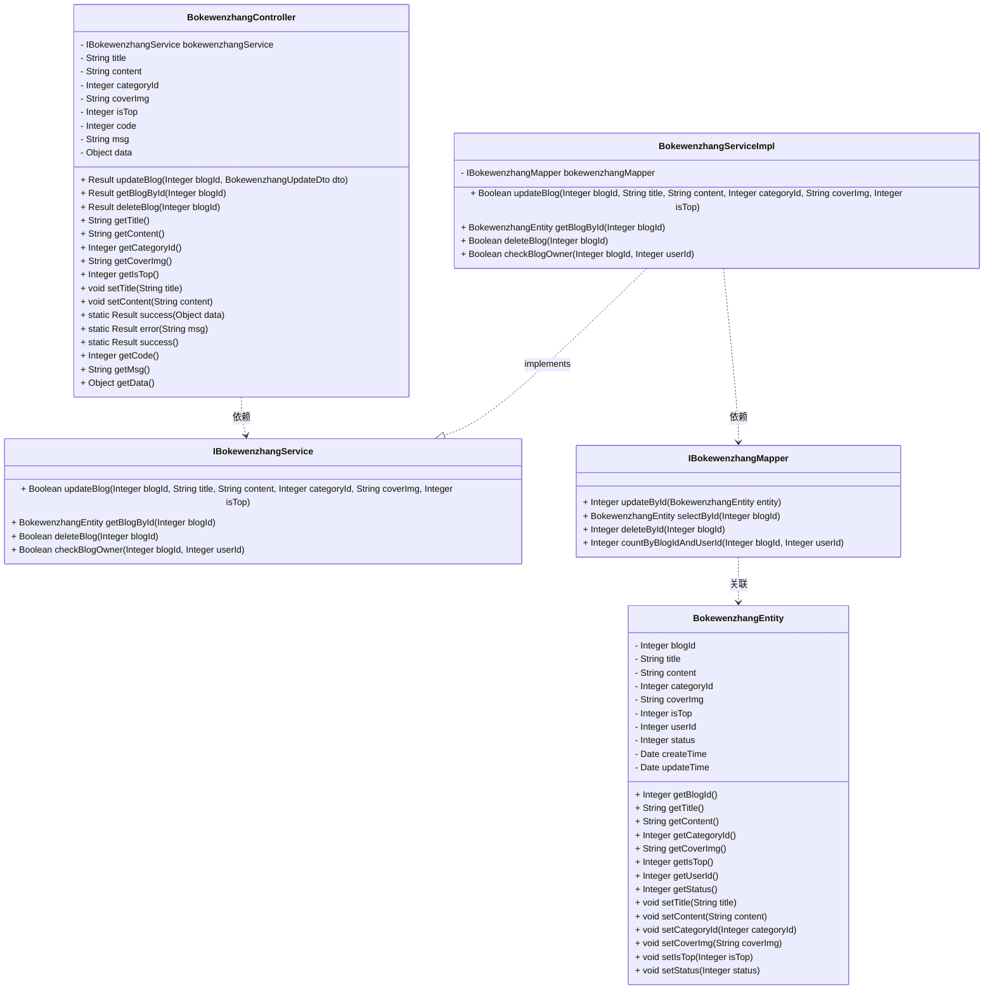

```mermaid
classDiagram
    BokewenzhangServiceImpl ..|> IBokewenzhangService : implements
    BokewenzhangController ..> IBokewenzhangService : 依赖
    BokewenzhangServiceImpl ..> IBokewenzhangMapper : 依赖
    IBokewenzhangMapper ..> BokewenzhangEntity : 关联

    class BokewenzhangController {
        - IBokewenzhangService bokewenzhangService
        + Result updateBlog(Integer blogId, BokewenzhangUpdateDto dto)
        + Result getBlogById(Integer blogId)
        + Result deleteBlog(Integer blogId)
        
        
            - String title
            - String content
            - Integer categoryId
            - String coverImg
            - Integer isTop
            + String getTitle()
            + String getContent()
            + Integer getCategoryId()
            + String getCoverImg()
            + Integer getIsTop()
            + void setTitle(String title)
            + void setContent(String content)
        
        
       
            - Integer code
            - String msg
            - Object data
            + static Result success(Object data)
            + static Result error(String msg)
            + static Result success()
            + Integer getCode()
            + String getMsg()
            + Object getData()
        
    }

    class IBokewenzhangService {
        + Boolean updateBlog(Integer blogId, String title, String content, Integer categoryId, String coverImg, Integer isTop)
        + BokewenzhangEntity getBlogById(Integer blogId)
        + Boolean deleteBlog(Integer blogId)
        + Boolean checkBlogOwner(Integer blogId, Integer userId)
    }

    class BokewenzhangServiceImpl {
        - IBokewenzhangMapper bokewenzhangMapper
        + Boolean updateBlog(Integer blogId, String title, String content, Integer categoryId, String coverImg, Integer isTop)
        + BokewenzhangEntity getBlogById(Integer blogId)
        + Boolean deleteBlog(Integer blogId)
        + Boolean checkBlogOwner(Integer blogId, Integer userId)
    }

    class IBokewenzhangMapper {
        + Integer updateById(BokewenzhangEntity entity)
        + BokewenzhangEntity selectById(Integer blogId)
        + Integer deleteById(Integer blogId)
        + Integer countByBlogIdAndUserId(Integer blogId, Integer userId)
    }

    class BokewenzhangEntity {
        - Integer blogId
        - String title
        - String content
        - Integer categoryId
        - String coverImg
        - Integer isTop
        - Integer userId
        - Integer status
        - Date createTime
        - Date updateTime
        + Integer getBlogId()
        + String getTitle()
        + String getContent()
        + Integer getCategoryId()
        + String getCoverImg()
        + Integer getIsTop()
        + Integer getUserId()
        + Integer getStatus()
        + void setTitle(String title)
        + void setContent(String content)
        + void setCategoryId(Integer categoryId)
        + void setCoverImg(String coverImg)
        + void setIsTop(Integer isTop)
        + void setStatus(Integer status)
    }
```