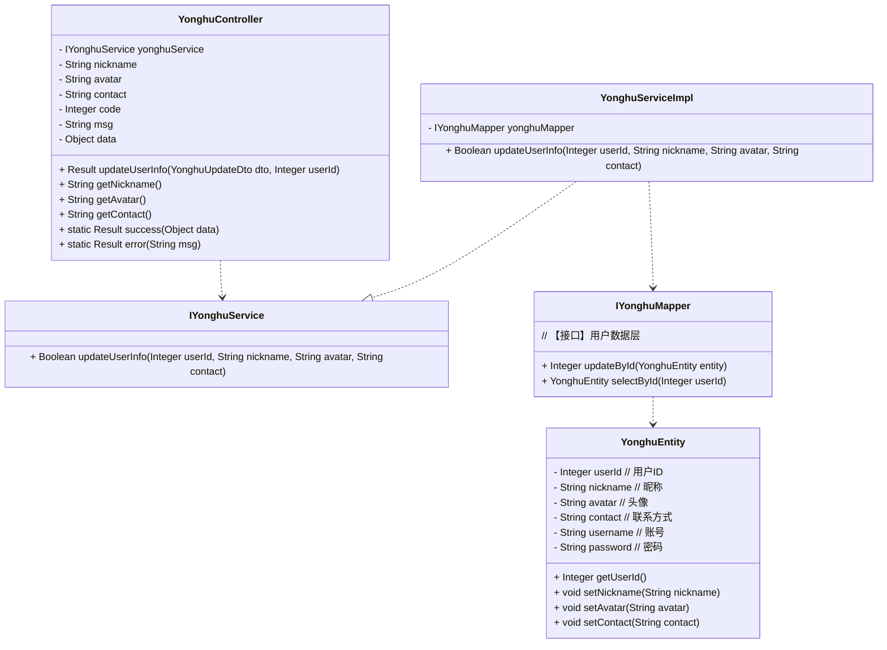

```mermaid
classDiagram
    %% 关系定义（仅用Class+implements）
    YonghuServiceImpl ..|> IYonghuService : 
    YonghuController ..> IYonghuService : 
    YonghuServiceImpl ..> IYonghuMapper : 
    IYonghuMapper ..> YonghuEntity : 

    %% Controller层
    class YonghuController {
        - IYonghuService yonghuService
        + Result updateUserInfo(YonghuUpdateDto dto, Integer userId)
        
        
            - String nickname      
            - String avatar         
            - String contact        
            + String getNickname()
            + String getAvatar()
            + String getContact()
        
        
    
            - Integer code
            - String msg      
            - Object data   
            + static Result success(Object data)
            + static Result error(String msg)
        
    }

    %% Service接口（伪装为Class，注释说明是接口）
    class IYonghuService {
    
        + Boolean updateUserInfo(Integer userId, String nickname, String avatar, String contact)
    }

    %% Service实现类
    class YonghuServiceImpl {
        - IYonghuMapper yonghuMapper
        + Boolean updateUserInfo(Integer userId, String nickname, String avatar, String contact)
    }

    %% Mapper接口（伪装为Class，注释说明是接口）
    class IYonghuMapper {
        // 【接口】用户数据层
        + Integer updateById(YonghuEntity entity)
        + YonghuEntity selectById(Integer userId)
    }

    %% Entity层
    class YonghuEntity {
        - Integer userId        // 用户ID
        - String nickname       // 昵称
        - String avatar         // 头像
        - String contact        // 联系方式
        - String username       // 账号
        - String password       // 密码
        + Integer getUserId()
        + void setNickname(String nickname)
        + void setAvatar(String avatar)
        + void setContact(String contact)
    }
```