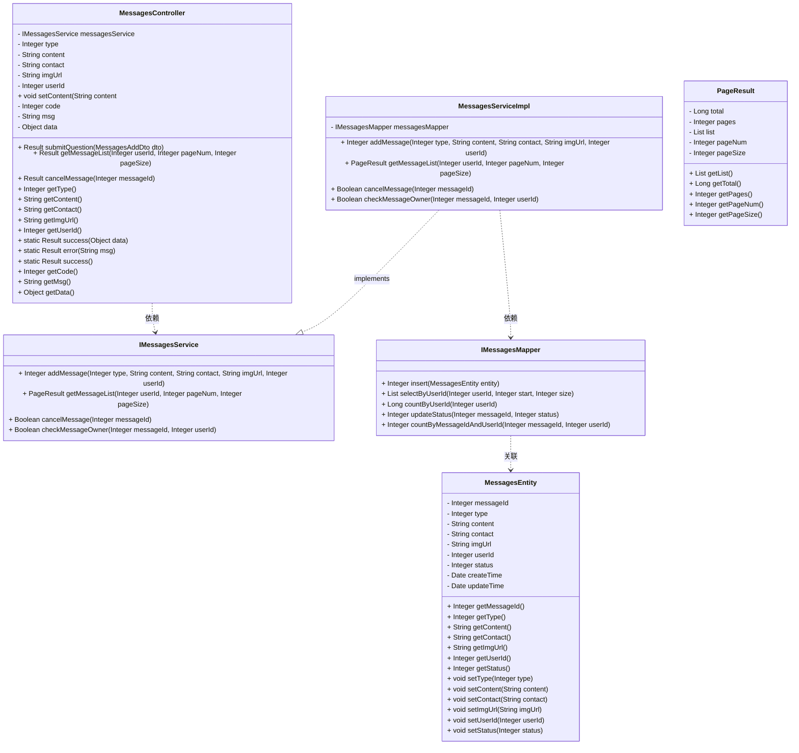

```mermaid
classDiagram
    MessagesServiceImpl ..|> IMessagesService : implements
    MessagesController ..> IMessagesService : 依赖
    MessagesServiceImpl ..> IMessagesMapper : 依赖
    IMessagesMapper ..> MessagesEntity : 关联

    class MessagesController {
        - IMessagesService messagesService
        + Result submitQuestion(MessagesAddDto dto)
        + Result getMessageList(Integer userId, Integer pageNum, Integer pageSize)
        + Result cancelMessage(Integer messageId)

            - Integer type
            - String content
            - String contact
            - String imgUrl
            - Integer userId
            + Integer getType()
            + String getContent()
            + String getContact()
            + String getImgUrl()
            + Integer getUserId()
            + void setContent(String content
        
     
            - Integer code
            - String msg
            - Object data
            + static Result success(Object data)
            + static Result error(String msg)
            + static Result success()
            + Integer getCode()
            + String getMsg()
            + Object getData()
        
    }

    class IMessagesService {
        + Integer addMessage(Integer type, String content, String contact, String imgUrl, Integer userId)
        + PageResult getMessageList(Integer userId, Integer pageNum, Integer pageSize)
        + Boolean cancelMessage(Integer messageId)
        + Boolean checkMessageOwner(Integer messageId, Integer userId)
    }

    class MessagesServiceImpl {
        - IMessagesMapper messagesMapper
        + Integer addMessage(Integer type, String content, String contact, String imgUrl, Integer userId)
        + PageResult getMessageList(Integer userId, Integer pageNum, Integer pageSize)
        + Boolean cancelMessage(Integer messageId)
        + Boolean checkMessageOwner(Integer messageId, Integer userId)
    }

    class IMessagesMapper {
        + Integer insert(MessagesEntity entity)
        + List selectByUserId(Integer userId, Integer start, Integer size)
        + Long countByUserId(Integer userId)
        + Integer updateStatus(Integer messageId, Integer status)
        + Integer countByMessageIdAndUserId(Integer messageId, Integer userId)
    }

    class MessagesEntity {
        - Integer messageId
        - Integer type
        - String content
        - String contact
        - String imgUrl
        - Integer userId
        - Integer status
        - Date createTime
        - Date updateTime
        + Integer getMessageId()
        + Integer getType()
        + String getContent()
        + String getContact()
        + String getImgUrl()
        + Integer getUserId()
        + Integer getStatus()
        + void setType(Integer type)
        + void setContent(String content)
        + void setContact(String contact)
        + void setImgUrl(String imgUrl)
        + void setUserId(Integer userId)
        + void setStatus(Integer status)
    }

    class PageResult {
        - Long total
        - Integer pages
        - List list
        - Integer pageNum
        - Integer pageSize
        + List getList()
        + Long getTotal()
        + Integer getPages()
        + Integer getPageNum()
        + Integer getPageSize()
    }
```